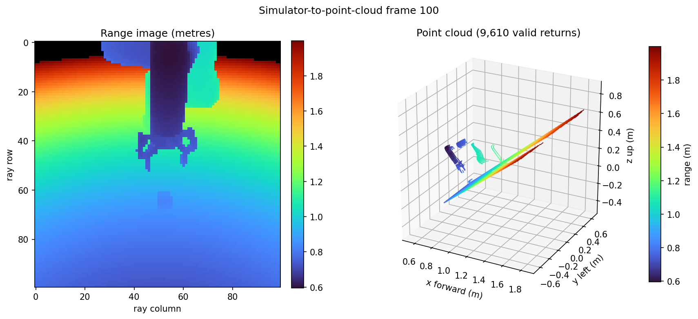

# MuJoCo Simulator to Point Cloud

A small, reproducible data-preprocessing toolkit extracted from the Point-LeWM Cube pipeline. It restores recorded MuJoCo states, casts a camera-aligned grid of native MuJoCo rays, and writes fixed-shape XYZ point clouds for world-model training.

The implementation follows the geometric observation protocol used in *Does Latent Planning Survive Point Clouds? Action-Conditioned JEPA World Models for Geometric Observations* and is adapted for the OGBench Cube setup in [le-wm](https://github.com/lucas-maes/le-wm).



## What is included

- `raycast.py`: reusable `MujocoRayCamera` for any MuJoCo model/data pair.
- `convert_cube_hdf5.py`: safe, resumable OGBench Cube HDF5 converter.
- `visualize_hdf5.py`: exports a range-image/3D PNG, colored PLY, and JSON stats.
- `requirements.txt`: minimal runtime and visualization dependencies.

The converter never modifies the source HDF5. It writes to
`OUTPUT.h5.partial`, periodically checkpoints progress, validates the result,
and atomically renames it to `OUTPUT.h5` only when complete. An existing final
output is never overwritten.

## Installation

Python 3.10 or newer is recommended.

```bash
git clone <your-repository-url>
cd <your-repository>/sim_to_pointcloud
python -m venv .venv
source .venv/bin/activate
pip install -r requirements.txt
```

The Cube adapter requires `stable-worldmodel`, because that package registers
the `swm/OGBCube-v0` Gymnasium environment. The reusable ray sensor itself only
requires MuJoCo and NumPy.

Versions used for the checked example are listed in
[`requirements.txt`](requirements.txt).

## Input format

`convert_cube_hdf5.py` expects an OGBench-style HDF5 with frame-aligned MuJoCo
state arrays:

```text
qpos: [num_frames, model.nq]
qvel: [num_frames, model.nv]
```

Other arrays such as `action`, `ep_len`, and `ep_offset` remain in the original
dataset. The generated point-cloud file is aligned row-for-row with that source
file, so training code can read actions from the source and geometry from the
derived file.

## Quick start

Benchmark the ray caster before allocating a large output file:

```bash
python convert_cube_hdf5.py \
  --source /path/to/cube_single_expert.h5 \
  --benchmark-frames 1000
```

Convert a small smoke-test subset:

```bash
python convert_cube_hdf5.py \
  --source /path/to/cube_single_expert.h5 \
  --output /path/to/cube_ray100_smoke.h5 \
  --max-frames 1000
```

Convert the complete dataset with the Point-LeWM Cube settings:

```bash
python convert_cube_hdf5.py \
  --source /path/to/cube_single_expert.h5 \
  --output /path/to/cube_single_expert_ray100.h5 \
  --camera front_pixels \
  --ray-resolution 100 \
  --max-range 2.0 \
  --alpha-threshold 0.5
```

If the process is interrupted, run the same command again. The argument and
source-file metadata are checked before resuming the `.partial` file.

Visualize one or more generated rows:

```bash
python visualize_hdf5.py \
  --input /path/to/cube_single_expert_ray100.h5 \
  --frames 0 100 1000 \
  --output-dir preview
```

Each selected row produces:

```text
preview/
├── frame_000100.png   # range image + 3D point-cloud view
├── frame_000100.ply   # valid XYZ returns, colored by range
└── frame_000100.json  # counts, bounds, ranges, and HDF5 metadata
```

PLY is an optional diagnostic export; disable it with `--no-ply`.

## Output format

The final HDF5 contains one dataset:

```text
pointcloud: [num_frames, ray_resolution**2, 3], float32
```

- Raster order is preserved: point `v * resolution + u` corresponds to ray
  pixel `(u, v)`.
- Misses, invalid returns, and hits beyond `max_range` are `[NaN, NaN, NaN]`.
- Each valid point is relative to the camera origin in sensor coordinates:
  `+X` forward, `+Y` left, `+Z` up.
- Only the first hit is retained.
- Geometry with direct RGBA alpha below `alpha_threshold` is excluded. This
  removes Cube's translucent goal marker from the observation.

At 100×100 rays, one uncompressed frame occupies 120,000 bytes. A 2.01-million
frame dataset has a logical XYZ payload of about 241 GB (224.7 GiB), so place
the output on a filesystem with sufficient free space.

## Using the ray sensor in another MuJoCo environment

`MujocoRayCamera` is independent of OGBench. The environment adapter only needs to expose its `MjModel` and `MjData` and place the simulator in the desired state before each scan:

```python
import mujoco

from raycast import MujocoRayCamera, RaySensorConfig

config = RaySensorConfig(
    camera="my_camera",
    resolution=100,
    max_range=2.0,
    alpha_threshold=0.5,
)

with MujocoRayCamera(model, data, config) as sensor:
    # Set data.qpos/data.qvel here, then forward the MuJoCo state.
    mujoco.mj_forward(model, data)
    frame = sensor.scan()
    xyz_dense = frame.points       # [10000, 3], misses are NaN
    xyz_valid = frame.valid_points # compact valid-only view
```

Camera transforms are refreshed for every scan, so fixed and body-mounted cameras are both supported. The class temporarily changes one unused MuJoCo geometry group to filter translucent geometry and restores the original groups when its context exits.

## 中文快速使用

这个目录把 Point-LeWM 使用的仿真状态转点云流程独立了出来：从 HDF5 读取每一帧的 `qpos/qvel`，恢复 MuJoCo 状态，再从指定相机发射规则射线。 无命中的射线保存为 NaN，有效点采用 `x向前、y向左、z向上` 的传感器坐标系。

建议先测速：

```bash
python convert_cube_hdf5.py \
  --source /path/to/cube_single_expert.h5 \
  --benchmark-frames 1000
```

再进行完整转换：

```bash
python convert_cube_hdf5.py \
  --source /path/to/cube_single_expert.h5 \
  --output /path/to/cube_single_expert_ray100.h5
```

程序中断后，使用完全相同的命令即可从 `.partial` 断点继续。最终文件只有在
完整性检查通过后才会出现。可视化使用：

```bash
python visualize_hdf5.py \
  --input /path/to/cube_single_expert_ray100.h5 \
  --frames 100 \
  --output-dir preview
```

## Reproducibility notes

- Ray directions pass through pixel centers and use the MuJoCo camera's vertical field of view.
- `mj_multiRay` performs native first-intersection queries; no RGB/depth renderer or OpenGL context is required.
- `--max-frames` is intended for smoke tests. Do not concatenate independently generated subsets unless their row offsets and metadata are tracked.
- For training, use one fixed dataset-level point normalization. Per-frame normalization destroys metric scale and is not performed here.

## License

MIT. See [`LICENSE`](LICENSE). The original le-wm copyright and license notice
are retained because this preprocessing code was developed from that project.

